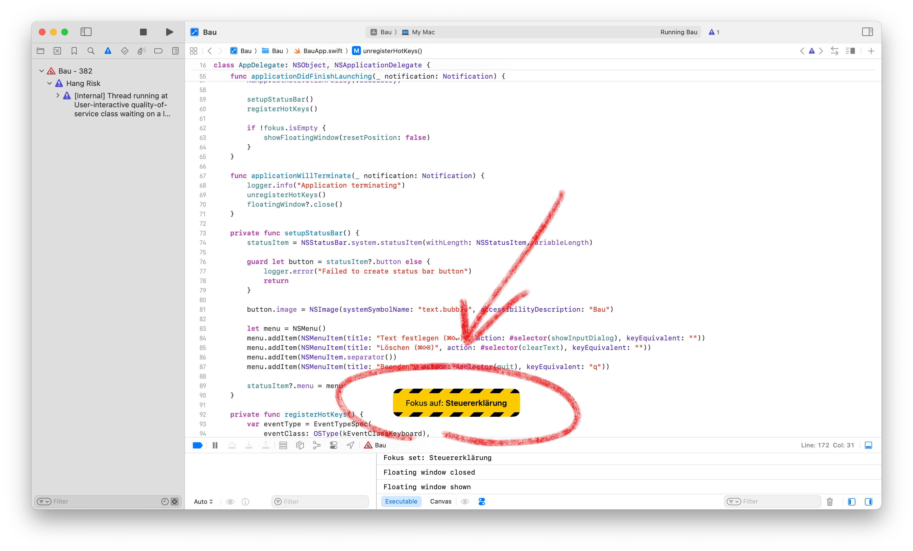

  

**Bau** — A minimalist macOS app that displays a persistent focus reminder floating on your screen. Drag it anywhere, and it stays visible on top of all windows across all spaces and applications.

## Shortcuts

- `⌘⇧↵` — Set focus text
- `⌘⇧⌫` — Clear focus text

## Installation

Build manually in Xcode:

1. Clone this repository
2. Open `Bau.xcodeproj` in Xcode
3. Build and run

## Requirements

- macOS Sequoia or later
- Xcode 26.0 or later

## License

GPL-3.0-or-later
